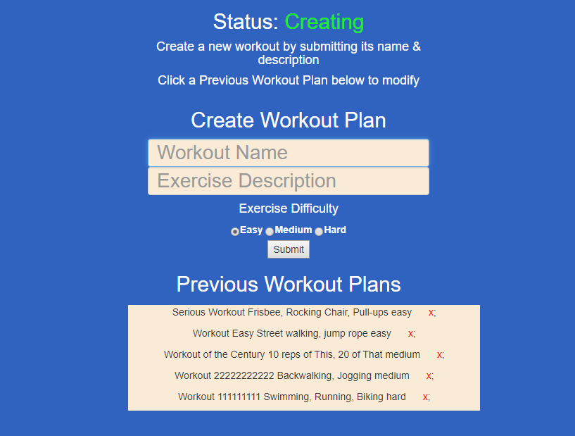
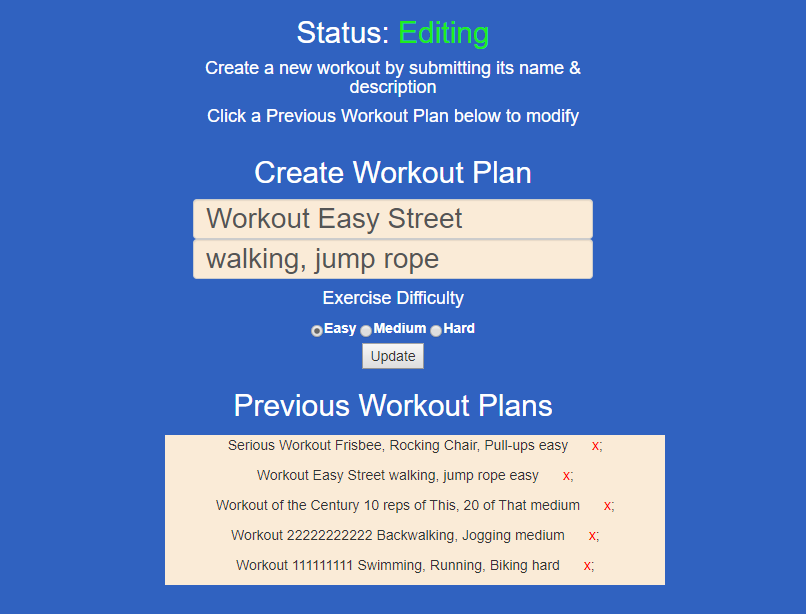

# NoSQL-Workout-Tracker-Homework

  

Unit 17 NoSql Homework: Workout Tracker
## Table of contents
* [General info](#general-info)  
* [User Story](#user-story)  
* [Business Context](#business-context)  
* [Instructions](#instructions)  
* [Link to Deployed App](#link-to-deployed-app)  
* [GitHub Repo](#github-repo)
* [Portfolio Page](#portfolio-page)
* [Screenshots](#screenshots) 

## General Info
For this assignment, you'll create a workout tracker. This assignment will require you to create Mongo database with a Mongoose schema and handle routes with Express.

## User Story
As a user, I want to be able to view create and track daily workouts.

## Business Context
A consumer will reach their fitness goals quicker when they track their workout progress.

## Acceptance Criteria
When the user loads the page, they should be given the option to create a new workout, or continue with their last workout.  
The user should be able to:

Add exercises to a previous workout plan.
Add new exercises to a new workout plan.

## Link to Deployed App
[Link to deployed app](https://fast-escarpment-82023.herokuapp.com/) 
(Click to open app)

## GitHub Repo:
https://github.com/cbush2014/NoSQL-Workout-Tracker-Homework     

## Portfolio Page
https://cbush2014.github.io/

## Screenshots

